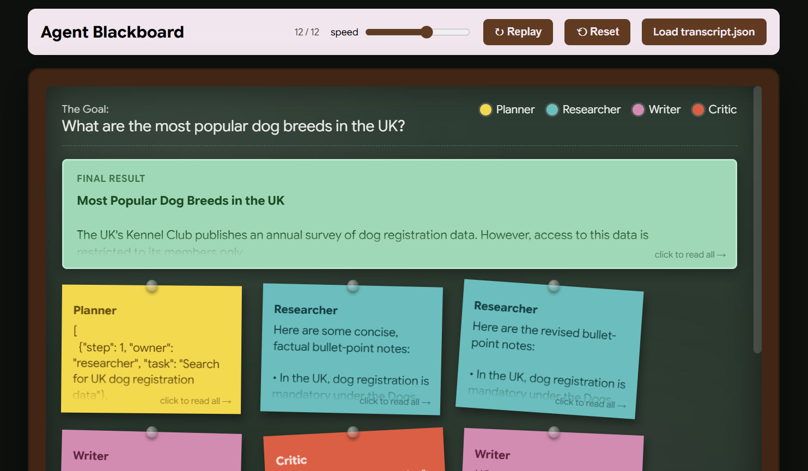

# Local Multi-Agent Blackboard Orchestrator

A local, multi-agent workflow that takes a user specified goal and automatically plans, researches, drafts, and critiques drafts in response until it generates a final output.

Four separate agents are used in this workflow: Planner, Researcher, Writer, and Critic. They collaborate through a shared "Blackboard." 
The underlying framework supports multiple LLM backends; it defaults to a lightweight Hugging Face transformers pipeline, but supports local .gguf files via llama.cpp.

## Main Features
* **Modular Agent Design:** Separate agents with specific system prompts keep the context window focused.
* **Automatic Fallbacks:** Attempts to load `llama-cpp-python` for local CPU/GPU execution, but falls back to Hugging Face `transformers` if unavailable.
* **Iterative Refinement:** The Critic agent forces output revisions until the quality threshold is met, or the max iterations is reached. The max iterations set in the code is: 4. However, this can be changed.
* **Live Web Visualiser:** Opens a live blackboard in your browser and streams each agent's output using a built-in web server.
* **Transcript Export:** Saves the run's transcript as JSON for `blackboard_visualiser.html`.

## Command-Line Arguments

| Argument | Type | Default | Description |
| :--- | :--- | :--- | :--- |
| `goal` | `string` | **Required** | The primary task or goal for the agents to accomplish. (Positional argument) |
| `--model-path` | `string` | `None` | Path to a local `.gguf` model file. Used when running the `llama-cpp-python` backend. |
| `--hf-fallback` | `string` | `Qwen/Qwen2.5-1.5B-Instruct` | Hugging Face model ID to use if `llama-cpp-python` is not installed or no model path is provided. |
| `--max-revisions` | `integer`| `4` | The maximum number of critique/revision cycles the agents are allowed to perform before terminating. |
| `--transcript-out` | `string` | `transcript.json` | Where to save the run's transcript as JSON for `blackboard_visualiser.html`. |
| `--live` | flag | N/A | Open a live blackboard in your browser and stream each agent's output. |
| `--port` | `integer` | `8765` | Port for the live server (used with `--live`). |

 

### Robustness note:
*When using small models (e.g. 3B-Q4 Llama model), expect the Critic's JSON to occasionally come back malformed. The `safe_json_obj` fallback handles this, outputting "Could not parse critique JSON" in the issues list.*

 

### Example of blackboard visualiser:

